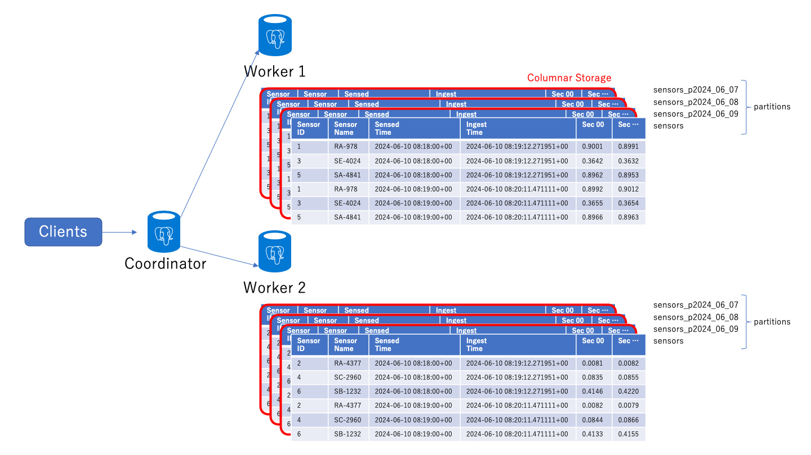

# What are the scenarios that this hands-on lab envisions?

It envisions a scenario in which tens of thousands of sensors record data per second, such as factories, power plants, and smart buildings, and transmit data for 60 seconds every minute.

If the sensors are globally deployed, Cosmos DB for PostgreSQL (CDBPG) does not support global distribution, so you should implement Multi-region Write using Cosmos DB for NoSQL. It is quite conceivable that a scenario in which a CDBPG is placed in a specific region (e.g., Azure Japan East) with a Function kicked by ChangeFeed, etc., is actually in production.

In hands-on, deploy a cluster with the minimum configuration, but if the number of sensors increases, the following points should be noted.

Align the citus.shard_count of the server parameter from the default of 32 to the total number of vCPUs of the worker nodes that make up the cluster. For example, if there are 4 nodes of 16 vCPU workers, the citus.shard_count should be set to 64 or higher. If the citus.shard_count is left as the default, it will be as follows.

1. There are 1,024 sensors, and if the sensor_id is used as a shard key as it is like this hands-on, the generated shard key is also distributed in 1024 ways.
2. If the citus.shard_count is 32, the shard key is a range of 32 (dividing the range of values of the 32-bit hash into 32), and each range is assigned to a worker node, resulting in 8 shards/node.
3. On the other hand, since the vCPU is 16, it will be 0.5 shards/vCPU, and one vCPU will handle two shards = processes. Since process switching occurs, the CPU cache hit ratio is low. A citus.shard_count of 64 is the appropriate size.
4. You can scale out the worker nodes (4→8 nodes) or scale up (16→32 vCPUs), but if the data size is large and the IO load is high, the general guideline is to choose scale-out and increase the number of SSDs, otherwise choose to scale up.
5. Increasing the number of nodes (cluster scale-out) and increasing the capacity of SSDs (storage scale-up) both improve the total IOPS, but note that neither can be scaled in.

# 0. About Cosmos DB for PostgreSQL (CDBPG)
The basic operations of CDBPGs are beyond the scope of this article.

It is mandatory to have taken [Hands-on Lab](https://github.com/tahayaka-microsoft/CosmosDBforPG_HoL/) in advance or have studied on your own.

Also, the content of this Hands-On Lab is an extended version of the "Real-Time Dashboard" of the Hands-On Lab linked above, so I will leave the understanding of the basics to it.

# 1. Deploying CDBPG
The hands-on is performed by deploying 2 worker nodes (4vCPUs, 512GB) with default server parameters.
Since the impact of performance at the time of AUTO_VACUUM is large at 4 vCPU, set 8 vCPU or more for production.
This is not the case if the AUTO_VACUUM can be performed outside of business hours, but in general, in IoT scenarios, the seasonality of data arrival is low, so 8 vCPU or more is recommended.

The end result is the distribution and partitioning of the data as follows.


# 2. RAW data table
## 2.1 Create table
It is also conceivable to separate the sensor_name into masters. In dummy data, a master is used to mimic a compound unique constraint.

sensor_id and sensor_name are supposed to be compound unique constraints, but they are not implemented here. UNIQUE(sensor_id, sensor_name)

The data from 00 to 59 seconds is separated into columns to improve the compression ratio in columnar storage.
If the same data is lined up in the array type, it may be defined in the array type.
In that case, please note that the UNNEST processing in the aggregation stage in the later stage will change.
By adding the USING COLUMNAR keyword when executing CREATE TABLE, it is possible to configure without using HEAP in the first place.
The performance improvement due to compression is quite significant, so you may decide after conducting a performance benchmark.

```sql
CREATE TABLE sensors(
    sensor_id bigint NOT NULL,
    sensor_name varchar(16) NOT NULL,
    sensed_time timestamptz NOT NULL,
    ingest_time timestamptz NOT NULL,
    sec_00 numeric(10,4),
    sec_01 numeric(10,4),
    sec_02 numeric(10,4),
    sec_03 numeric(10,4),
    sec_04 numeric(10,4),
    sec_05 numeric(10,4),
    sec_06 numeric(10,4),
    sec_07 numeric(10,4),
    sec_08 numeric(10,4),
    sec_09 numeric(10,4),
    sec_10 numeric(10,4),
    sec_11 numeric(10,4),
    sec_12 numeric(10,4),
    sec_13 numeric(10,4),
    sec_14 numeric(10,4),
    sec_15 numeric(10,4),
    sec_16 numeric(10,4),
    sec_17 numeric(10,4),
    sec_18 numeric(10,4),
    sec_19 numeric(10,4),
    sec_20 numeric(10,4),
    sec_21 numeric(10,4),
    sec_22 numeric(10,4),
    sec_23 numeric(10,4),
    sec_24 numeric(10,4),
    sec_25 numeric(10,4),
    sec_26 numeric(10,4),
    sec_27 numeric(10,4),
    sec_28 numeric(10,4),
    sec_29 numeric(10,4),
    sec_30 numeric(10,4),
    sec_31 numeric(10,4),
    sec_32 numeric(10,4),
    sec_33 numeric(10,4),
    sec_34 numeric(10,4),
    sec_35 numeric(10,4),
    sec_36 numeric(10,4),
    sec_37 numeric(10,4),
    sec_38 numeric(10,4),
    sec_39 numeric(10,4),
    sec_40 numeric(10,4),
    sec_41 numeric(10,4),
    sec_42 numeric(10,4),
    sec_43 numeric(10,4),
    sec_44 numeric(10,4),
    sec_45 numeric(10,4),
    sec_46 numeric(10,4),
    sec_47 numeric(10,4),
    sec_48 numeric(10,4),
    sec_49 numeric(10,4),
    sec_50 numeric(10,4),
    sec_51 numeric(10,4),
    sec_52 numeric(10,4),
    sec_53 numeric(10,4),
    sec_54 numeric(10,4),
    sec_55 numeric(10,4),
    sec_56 numeric(10,4),
    sec_57 numeric(10,4),
    sec_58 numeric(10,4),
    sec_59 numeric(10,4)
) PARTITION BY RANGE (sensed_time);
```

## 2.1 Create index
```sql
CREATE INDEX sensor_name_index ON sensors (sensor_name);
```

## 2.2 Configure shards
```sql
SELECT create_distributed_table('sensors', 'sensor_id');
```

You can check the shard configuration with the following query.
```sql
SELECT * FROM citus_shards;
```

## 2.3 Configure partitions

This can be done hourly, but the number of partitions can be too large,
so the decision should be made based on the total data capacity, data volume, and data lifecycle.
```sql
SELECT create_time_partitions(
    table_name         := 'sensors',
    partition_interval := '1 day',
    end_at             := now() + '7 days'
);
```

After execution, check the table created with \d.
```sql
\d
```

See below for partition management.
Create partitions for 7 days
```sql
-- Delete partition
-- drop_old_time_partitions
-- alternate heap / columnar
-- alter_old_partitions_set_access_method
```

## 2.4 Automate partition management
Automate the creation of partitions for 7 days
```sql
SELECT cron.schedule('create-partitions_sensors',
    '@daily',
    $$SELECT create_time_partitions(table_name:='sensors',
        partition_interval:= '1 day',
        end_at:= now() + '7 days') $$
);
```

See below for queries about the configured cron job.
```sql
-- List of jobs
SELECT * FROM cron.job;
```
```sql
-- Delete a job with job ID from the schedule
-- SELECT cron.unschedule(job id);
```

Shrink partitions older than 5 days
```sql
SELECT cron.schedule('compress-partitions_sensors',
    '@daily',
    $$CALL alter_old_partitions_set_access_method('sensors',
        now() - interval '5 days', 'columnar') $$
);
```

# 3 Table for minutely roll-up
## 3.1 Create table
```sql
CREATE TABLE sensors_1min(
    sensor_id bigint,
    sensor_name varchar(16),
    sensed_time timestamptz,
    avg numeric(10,4),
    min numeric(10,4),
    max numeric(10,4)
    CHECK (sensed_time = date_trunc('minute', sensed_time))
) PARTITION BY RANGE (sensed_time);
```

## 3.2 Create index
```sql
CREATE INDEX sensor_name_1min_index ON sensors_1min (sensor_name);
```

## 3.3 Configure shards
```sql
SELECT create_distributed_table('sensors_1min', 'sensor_id');
```

## 3.4 Configure partitions
Create partitions for 7 days
```sql
SELECT create_time_partitions(
    table_name         := 'sensors_1min',
    partition_interval := '1 day',
    end_at             := now() + '7 days'
);
```

## 3.5 Automate partition management
Automate the creation of partitions for 7 days
```sql
SELECT cron.schedule('create-partitions_sensors_1min',
    '@daily',
    $$SELECT create_time_partitions(table_name:='sensors_1min',
        partition_interval:= '1 day',
        end_at:= now() + '7 days') $$
);
```

Shrink partitions older than 5 days
```sql
SELECT cron.schedule('compress-partitions_sensors_1min',
    '@daily',
    $$CALL alter_old_partitions_set_access_method('sensors_1min',
        now() - interval '5 days', 'columnar') $$
);
```

## 3.6 Record the latest roll-up in minute resolution
Create table
```sql
CREATE TABLE latest_rollup_1min (
    rolled_at timestamptz PRIMARY KEY,
    CHECK (rolled_at = date_trunc('minute', rolled_at))
);
```

# 4 Table for hourly roll-up
## 4.1 Create table
```sql
CREATE TABLE sensors_1hour(
    sensor_id bigint,
    sensor_name varchar(16),
    sensed_time timestamptz,
    avg numeric(10,4),
    min numeric(10,4),
    max numeric(10,4),
    CHECK (sensed_time = date_trunc('hour', sensed_time))
) PARTITION BY RANGE (sensed_time);
```

## 4.2 Create index
```sql
CREATE INDEX sensor_name_1hour_index ON sensors_1hour (sensor_name);
```

## 4.3 Configure shards
```sql
SELECT create_distributed_table('sensors_1hour', 'sensor_id');
```

## 4.4 Configure partitions
Create partitions for 7 days
```sql
SELECT create_time_partitions(
    table_name         := 'sensors_1hour',
    partition_interval := '1 day',
    end_at             := now() + '7 days'
);
```

## 4.5 Automate partition management
Automate the creation of partitions for 7 days
```sql
SELECT cron.schedule('create-partitions_sensors_1hour',
    '@daily',
    $$SELECT create_time_partitions(table_name:='sensors_1hour',
        partition_interval:= '1 day',
        end_at:= now() + '7 days') $$
);
```

Shrink partitions older than 5 days
```sql
SELECT cron.schedule('compress-partitions_sensors_1hour',
    '@daily',
    $$CALL alter_old_partitions_set_access_method('sensors_1hour',
        now() - interval '5 days', 'columnar') $$
);
```

## 4.6 Record the latest roll-up in hour resolution
Create table
```sql
CREATE TABLE latest_rollup_1hour (
    rolled_at timestamptz PRIMARY KEY,
    CHECK (rolled_at = date_trunc('hour', rolled_at))
);
```

# 5 Table for daily roll-up
## 5.1 Create table
```sql
CREATE TABLE sensors_1day(
    sensor_id bigint,
    sensor_name varchar(16),
    sensed_time timestamptz,
    avg numeric(10,4),
    min numeric(10,4),
    max numeric(10,4),
    CHECK (sensed_time = date_trunc('day', sensed_time))
) PARTITION BY RANGE (sensed_time);
```

## 5.2 Create index
```sql
CREATE INDEX sensor_name_1day_index ON sensors_1day (sensor_name);
```

## 5.3 Configure shards
```sql
SELECT create_distributed_table('sensors_1day', 'sensor_id');
```

## 5.4 Configure partitions
Create partitions for 7 days
```sql
SELECT create_time_partitions(
    table_name         := 'sensors_1day',
    partition_interval := '1 day',
    end_at             := now() + '7 days'
);
```

## 5.5 Automate partition management
Automate the creation of partitions for 7 days
```sql
SELECT cron.schedule('create-partitions_sensors_1day',
    '@daily',
    $$SELECT create_time_partitions(table_name:='sensors_1day',
        partition_interval:= '1 day',
        end_at:= now() + '7 days') $$
);
```

Shrink partitions older than 5 days
```sql
SELECT cron.schedule('compress-partitions_sensors_1day',
    '@daily',
    $$CALL alter_old_partitions_set_access_method('sensors_1day',
        now() - interval '5 days', 'columnar') $$
);
```

## 5.6 Record the latest roll-up in day resolution
Create table
```sql
CREATE TABLE latest_rollup_1day (
    rolled_at timestamptz PRIMARY KEY,
    CHECK (rolled_at = date_trunc('day', rolled_at))
);
```

# 6 Table for weekly roll-up
## 6.1 Create table
```sql
CREATE TABLE sensors_1week(
    sensor_id bigint,
    sensor_name varchar(16),
    sensed_time timestamptz,
    avg numeric(10,4),
    min numeric(10,4),
    max numeric(10,4),
    CHECK (sensed_time = date_trunc('day', sensed_time))
) PARTITION BY RANGE (sensed_time);
```

## 6.2 Create index
```sql
CREATE INDEX sensor_name_1week_index ON sensors_1week (sensor_name);
```

## 6.3 Configure shards
```sql
SELECT create_distributed_table('sensors_1week', 'sensor_id');
```

## 6.4 Configure partitions
Create partitions for 2 weeks
```sql
SELECT create_time_partitions(
    table_name         := 'sensors_1week',
    partition_interval := '1 week',
    end_at             := now() + '2 weeks'
);
```

## 6.5 Automate partition management
Automate the creation of partitions for 2 weeks
```sql
SELECT cron.schedule('create-partitions_sensors_1week',
    '@weekly',
    $$SELECT create_time_partitions(table_name:='sensors_1week',
        partition_interval:= '1 week',
        end_at:= now() + '2 weeks') $$
);
```

Shrink partitions older than 5 weeks
```sql
SELECT cron.schedule('compress-partitions_sensors_1week',
    '@weekly',
    $$CALL alter_old_partitions_set_access_method('sensors_1week',
        now() - interval '5 weeks', 'columnar') $$
);
```

## 6.6 Record the latest roll-up in week resolution
Create table
```sql
CREATE TABLE latest_rollup_1week (
    rolled_at timestamptz PRIMARY KEY,
    CHECK (rolled_at = date_trunc('day', rolled_at))
);
```

# 7 Master table for dummy data of sensors
## 7.1 Create table
The following is the procedure to check whether it works correctly with the settings so far.
Production data arrives at the system in the form of files, etc., and Functions etc. kicked by Storage Triggers etc. ingest.
It is assumed that the sensor_id and sensor_name satisfy the uniqueness constraint at the stage of the original data, but there is no problem in imposing constraints as table definitions.
```sql
CREATE TABLE dummy_sensor_ms(
    sensor_id bigint,
    sensor_name varchar(16)
);
```

## 7.2 Configure shards

Since it is master data, it is a Reference table.
The Reference table is a variant of the Distributed table, where the same shard is placed on all nodes.

```sql
SELECT create_reference_table('dummy_sensor_ms');
```

## 7.3 Generate dummy data for sensors

Align with the number of sensors (generate_series argument) in the next step.

```sql
INSERT INTO dummy_sensor_ms (
    sensor_id, sensor_name
)
SELECT
    i,
    concat(('{SA,SB,SC,SD,SE,RA,RB,GF,GT,CL}'::text[])[ceil(random()*10)], '-', (random() * 1000000)::int % 10000)
FROM GENERATE_SERIES(1, 1024) AS i;
```
       
# 8 Test with dummy RAW data
## 8.1 Generate dummy RAW data
Create a dummy_generator.sql with the following contents and execute it with psql -f dummy_generator.sql (background execution).
You can either use a cloud shell editor or create one on your local machine.

```sql
DO $$
BEGIN LOOP
    INSERT INTO sensors (
        sensor_id,
        sensor_name,
        sensed_time,
        ingest_time,
        sec_00, sec_01, sec_02, sec_03, sec_04, sec_05, sec_06, sec_07, sec_08, sec_09, sec_10, sec_11, sec_12, sec_13, sec_14, sec_15, sec_16, sec_17, sec_18, sec_19, sec_20, sec_21, sec_22, sec_23, sec_24, sec_25, sec_26, sec_27, sec_28, sec_29, sec_30, sec_31, sec_32, sec_33, sec_34, sec_35, sec_36, sec_37, sec_38, sec_39, sec_40, sec_41, sec_42, sec_43, sec_44, sec_45, sec_46, sec_47, sec_48, sec_49, sec_50, sec_51, sec_52, sec_53, sec_54, sec_55, sec_56, sec_57, sec_58, sec_59
    ) 
    SELECT
        i,
        ms.sensor_name,
        date_trunc('minute', now() - INTERVAL '1 minute'),
        clock_timestamp(),
        random(), random(), random(), random(), random(), random(), random(), random(), random(), random(), random(), random(), random(), random(), random(), random(), random(), random(), random(), random(), random(), random(), random(), random(), random(), random(), random(), random(), random(), random(), random(), random(), random(), random(), random(), random(), random(), random(), random(), random(), random(), random(), random(), random(), random(), random(), random(), random(), random(), random(), random(), random(), random(), random(), random(), random(), random(), random(), random(), random()
    FROM GENERATE_SERIES(1, 1024) AS i
    JOIN dummy_sensor_ms ms ON ms.sensor_id = i
    ;
    COMMIT;
    PERFORM pg_sleep(60);
END LOOP;
END $$;
```

## 8.2 Check if the data was generated
```sql
SELECT * FROM sensors LIMIT 10;
```

# 9 Function for minutely roll-up
## 9.1 Initiarize latest roll-up time
```sql
INSERT INTO latest_rollup_1min VALUES ('10-10-1901');
```

## 9.2 Create function
```sql
CREATE OR REPLACE FUNCTION rollup_minutely() RETURNS void AS $$
    DECLARE
        curr_rollup_time timestamptz := date_trunc('minute', now());
        last_rollup_time timestamptz := rolled_at from latest_rollup_1min;
    BEGIN
        INSERT INTO sensors_1min (
            sensor_id, sensor_name, sensed_time,
            avg, min, max
        )
        SELECT
            sensor_id,
            sensor_name,
            date_trunc('minute', sensed_time),
            AVG(vals), MIN(vals), MAX(vals) FROM (
                SELECT sensor_id, sensor_name, sensed_time, UNNEST(ARRAY[sec_00, sec_01, sec_02, sec_03, sec_04, sec_05, sec_06, sec_07, sec_08, sec_09, sec_10, sec_11, sec_12, sec_13, sec_14, sec_15, sec_16, sec_17, sec_18, sec_19, sec_20, sec_21, sec_22, sec_23, sec_24, sec_25, sec_26, sec_27, sec_28, sec_29, sec_30, sec_31, sec_32, sec_33, sec_34, sec_35, sec_36, sec_37, sec_38, sec_39, sec_40, sec_41, sec_42, sec_43, sec_44, sec_45, sec_46, sec_47, sec_48, sec_49, sec_50, sec_51, sec_52, sec_53, sec_54, sec_55, sec_56, sec_57, sec_58, sec_59]) AS vals
                FROM sensors
                WHERE date_trunc('minute', ingest_time) <@
                tstzrange(last_rollup_time, curr_rollup_time, '(]')
                ) AS unnested
                GROUP BY sensor_id, sensor_name, sensed_time;

        UPDATE latest_rollup_1min SET rolled_at = curr_rollup_time;
    END;
$$ LANGUAGE plpgsql;
```
## 9.3 Automate function for minutely roll-up
```sql
SELECT cron.schedule('roll_up_1min',
    '* * * * *',
    'SELECT rollup_minutely();'
);
```

# 10 Function for hourly roll-up
## 10.1 Initiarize latest roll-up time
```sql
INSERT INTO latest_rollup_1hour VALUES ('10-10-1901');
```

## 10.2 Create function
```sql
CREATE OR REPLACE FUNCTION rollup_hourly() RETURNS void AS $$
    DECLARE
        curr_rollup_time timestamptz := date_trunc('hour', now());
        last_rollup_time timestamptz := rolled_at from latest_rollup_1hour;
    BEGIN
        INSERT INTO sensors_1hour (
            sensor_id, sensor_name, sensed_time,
            avg, min, max
        )
        SELECT
            sensor_id,
            sensor_name,
            date_trunc('hour', sensed_time),
            AVG(avg), MIN(min), MAX(max)
            FROM sensors_1min
            WHERE date_trunc('hour', sensed_time) <@
            tstzrange(last_rollup_time, curr_rollup_time, '(]')
            GROUP BY sensor_id, sensor_name, sensed_time;

        UPDATE latest_rollup_1hour SET rolled_at = curr_rollup_time;
    END;
$$ LANGUAGE plpgsql;
```

## 10.3 Automate function for hourly roll-up

Assumed to run at 01 minutes every hour.

```sql
SELECT cron.schedule('roll_up_1hour',
    '1 * * * *',
    'SELECT rollup_hourly();'
);
```

# 11 Function for daily roll-up
## 11.1 Initiarize latest roll-up time
```sql
INSERT INTO latest_rollup_1day VALUES ('10-10-1901');
```

## 11.2 Create function
```sql
CREATE OR REPLACE FUNCTION rollup_daily() RETURNS void AS $$
    DECLARE
        curr_rollup_time timestamptz := date_trunc('day', now());
        last_rollup_time timestamptz := rolled_at from latest_rollup_1day;
    BEGIN
        INSERT INTO sensors_1day (
            sensor_id, sensor_name, sensed_time,
            avg, min, max
        )
        SELECT
            sensor_id,
            sensor_name,
            date_trunc('day', sensed_time),
            AVG(avg), MIN(min), MAX(max)
            FROM sensors_1hour
            WHERE date_trunc('day', sensed_time) <@
            tstzrange(last_rollup_time, curr_rollup_time, '(]')
            GROUP BY sensor_id, sensor_name, sensed_time;

        UPDATE latest_rollup_1day SET rolled_at = curr_rollup_time;
    END;
$$ LANGUAGE plpgsql;
```

## 11.3 Automate function for daily roll-up

Assumed to run at 0:10am every day.

```sql
SELECT cron.schedule('roll_up_1day',
    '10 0 * * *',
    'SELECT rollup_daily();'
);
```

# 12 Function for weekly roll-up
## 12.1 Initiarize latest roll-up time
```sql
INSERT INTO latest_rollup_1week VALUES ('10-10-1901');
```

## 12.2 Create function
```sql
CREATE OR REPLACE FUNCTION rollup_weekly() RETURNS void AS $$
    DECLARE
        curr_rollup_time timestamptz := date_trunc('day', now());
        last_rollup_time timestamptz := rolled_at from latest_rollup_1week;
    BEGIN
        INSERT INTO sensors_1week (
            sensor_id, sensor_name, sensed_time,
            avg, min, max
        )
        SELECT
            sensor_id,
            sensor_name,
            date_trunc('day', now() - INTERVAL '1 day' * date_part('dow', sensed_time)),
            AVG(avg), MIN(min), MAX(max)
            FROM sensors_1day
            WHERE date_trunc('day', sensed_time) <@
            tstzrange(last_rollup_time, curr_rollup_time, '(]')
            GROUP BY sensor_id, sensor_name, sensed_time;

        UPDATE latest_rollup_1week SET rolled_at = curr_rollup_time;
    END;
$$ LANGUAGE plpgsql;
```

## 12.3 Automate function for weekly roll-up

Assumed to run at 2:00am every Monday.

```sql
SELECT cron.schedule('roll_up_1week',
    '0 2 * * mon',
    'SELECT rollup_weekly();'
);
```

# 13 Check if aggregations are executed
## 13.1 Minutely roll-up
```sql
SELECT * FROM sensors_1min LIMIT 10;
```

## 13.2 Hourly roll-up
```sql
SELECT * FROM sensors_1hour LIMIT 10;
```
If the hourly roll-up has already been executed, the hourly roll-up function can be executed manually to confirm the operation.
The same applies to daily and weekly hereinafter.
```sql
SELECT rollup_hourly();
```

## 13.3 Daily roll-up
```sql
SELECT * FROM sensors_1day LIMIT 10;
```

## 13.4 Weekly roll-up
```sql
SELECT * FROM sensors_1week LIMIT 10;
```
# 14 Generation of dummy data that mimics production environment (optional)

Replace step 7 onwards below. Please note that the cost is high because the cluster configuration assumes production.

However, since it is necessary to prepare an old partition when storing past data, create a partition for each table as follows.
```sql
SELECT create_time_partitions(
    table_name         := 'sensors',
    partition_interval := '1 day',
    start_from    := '2024-06-01'::timestamptz,
    end_at := now()
);
```

## 14.1 Change citus.shard_count from default

Deploy a new CDBPG and set the citus.shard_count equal to the total vCPUs of the worker nodes.
Coordinator node: 16vCPU, 512GB
Worker nodes: 16vCPU, 2TB x 4 nodes

From the Azure portal, change the citus.shard_count of the Coordinator node parameter to 64 (16 vCPUs x 4 nodes).

## 14.2 Master table for dummy sensor data

Create Table
```sql
CREATE TABLE dummy_sensor_ms(
    sensor_id bigint,
    sensor_name varchar(16)
);
```

Configure shards
```sql
SELECT create_reference_table('dummy_sensor_ms');
```

Generate dummy sensor master data. Assume 100 times the number of sensors in step 7.

```sql
INSERT INTO dummy_sensor_ms (
    sensor_id, sensor_name
)
SELECT
    i,
    concat(('{SA,SB,SC,SD,SE,RA,RB,GF,GT,CL}'::text[])[ceil(random()*10)], '-', (random() * 1000000)::int % 10000)
FROM GENERATE_SERIES(1, 102400) AS i;
```

## 14.3 Generate dummy data

Generate dummy data for one week.
RAW data is 102,400 sensors x 604,800 seconds = 61,931,520,000, or about 62 billion records.
The reason why you don't execute everything with generate_series() is because if you don't COMMIT in the middle, it will be out of memory.

```sql
DO $$
    BEGIN
        FOR dd in 1..7 LOOP
            FOR dh in 0..23 LOOP
                INSERT INTO sensors (
                    sensor_id,
                    sensor_name,
                    sensed_time,
                    ingest_time,
                    sec_00, sec_01, sec_02, sec_03, sec_04, sec_05, sec_06, sec_07, sec_08, sec_09, sec_10, sec_11, sec_12, sec_13, sec_14, sec_15, sec_16, sec_17, sec_18, sec_19, sec_20, sec_21, sec_22, sec_23, sec_24, sec_25, sec_26, sec_27, sec_28, sec_29, sec_30, sec_31, sec_32, sec_33, sec_34, sec_35, sec_36, sec_37, sec_38, sec_39, sec_40, sec_41, sec_42, sec_43, sec_44, sec_45, sec_46, sec_47, sec_48, sec_49, sec_50, sec_51, sec_52, sec_53, sec_54, sec_55, sec_56, sec_57, sec_58, sec_59
                ) 
                SELECT
                    id,
                    ms.sensor_name,
                    concat('2024-06-', to_char(dd, 'FM00'), ' ', to_char(dh, 'FM00'), ':', to_char(dm, 'FM00'), ':00+00')::timestamptz,
                    concat('2024-06-', to_char(dd, 'FM00'), ' ', to_char(dh, 'FM00'), ':', to_char(dm, 'FM00'), ':00+00')::timestamptz + INTERVAL '1 minute',
                    random(), random(), random(), random(), random(), random(), random(), random(), random(), random(), random(), random(), random(), random(), random(), random(), random(), random(), random(), random(), random(), random(), random(), random(), random(), random(), random(), random(), random(), random(), random(), random(), random(), random(), random(), random(), random(), random(), random(), random(), random(), random(), random(), random(), random(), random(), random(), random(), random(), random(), random(), random(), random(), random(), random(), random(), random(), random(), random(), random()
                FROM
                    GENERATE_SERIES(0, 59) AS dm,
                    GENERATE_SERIES(1, 102400) AS id
                JOIN dummy_sensor_ms ms ON ms.sensor_id = id
                ;
                COMMIT;
            END LOOP;
        END LOOP;
END;
$$;
```

Check that there is a sufficient load during data generation.
If the load is low, multiple queries to generate data should be executed in parallel, and if the CPU is not properly loaded, it will take extra time.
For example, for a single query (before 7PM in the graph) and a query with 7 parallels (after 7PM), we can see that 7 parallels is a good size.


There is also a way to output to a file.
However, it should be noted that if you generate one week's worth of data with this number of sensors, the file size will be about 1 TB.
```sql
\COPY
    (SELECT
        id,
        ms.sensor_name,
        concat('2024-06-01 ', to_char(dh, 'FM00'), ':', to_char(dm, 'FM00'), ':00+00')::timestamptz,
        concat('2024-06-01 ', to_char(dh, 'FM00'), ':', to_char(dm, 'FM00'), ':00+00')::timestamptz + INTERVAL '1 minute',
        random(), random(), random(), random(), random(), random(), random(), random(), random(), random(), random(), random(), random(), random(), random(), random(), random(), random(), random(), random(), random(), random(), random(), random(), random(), random(), random(), random(), random(), random(), random(), random(), random(), random(), random(), random(), random(), random(), random(), random(), random(), random(), random(), random(), random(), random(), random(), random(), random(), random(), random(), random(), random(), random(), random(), random(), random(), random(), random(), random()
    FROM
        GENERATE_SERIES(0, 23) AS dh,
        GENERATE_SERIES(0, 59) AS dm,
        GENERATE_SERIES(1, 102400) AS id
    JOIN dummy_sensor_ms ms ON ms.sensor_id = id)
TO dummy_data.csv WITH CSV;
```

## 14.4 Execution from step 9 onwards

By manually executing each rollup without setting automatic execution by pg_cron, the actual amount of data can be measured.
Use metrics from the Azure portal or run the following queries:

```sql
SELECT logicalrelid AS name,
       pg_size_pretty(citus_table_size(logicalrelid)) AS size
  FROM pg_dist_partition;
```
